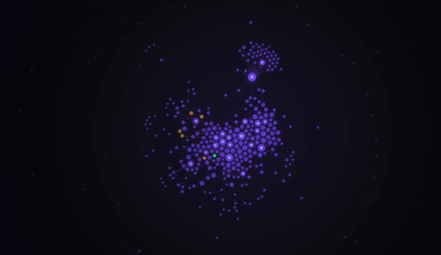

# Obsidian Live Wallpaper

> Your knowledge graph, drifting quietly behind your desktop icons.



A tiny tool that turns your Obsidian vault's graph view into a live, animated desktop wallpaper. New notes appear within seconds of saving. Zero labels, fully ambient — meant to be glanced at, not read.

**macOS today. Windows and Linux on the roadmap.**

## Why

The Obsidian graph view is beautiful and almost nobody looks at it, because it's buried two clicks deep inside the app. This project moves it to the one screen you actually stare at all day.

## Install (macOS, ~5 minutes)

You'll need [Node.js](https://nodejs.org) (v14+) and the free [Plash](https://apps.apple.com/us/app/plash/id1494023538) app from the Mac App Store.

```bash
git clone https://github.com/willytop8/obsidian-live-wallpaper.git
cd obsidian-live-wallpaper
npm install
cp config.example.json config.json
```

Edit `config.json` and set `vaultPath` to your Obsidian vault. Then:

```bash
npm start
```

Open Plash → **Add Website** → paste `file:///absolute/path/to/obsidian-live-wallpaper/index.html`. Done.

For autostart and troubleshooting, see [`macos-setup.md`](macos-setup.md).

## How it works

Three layers, each ignorant of the others:

```
┌──────────┐    graph.json    ┌──────────┐    file://     ┌───────┐
│  parser  │ ───────────────▶ │ renderer │ ─────────────▶ │ Plash │
│ (Node)   │                  │  (d3)    │                │ (Mac) │
└──────────┘                  └──────────┘                └───────┘
```

1. **`parser.js`** watches your vault, parses `[[wikilinks]]` from every `.md` file, writes `graph.json`.
2. **`index.html`** loads `graph.json`, runs a d3 force simulation on a fullscreen canvas, polls for updates every 5 seconds.
3. **Plash** renders the HTML file as your desktop wallpaper.

The clean separation is the whole reason the Windows/Linux ports are nearly free — only the host changes.

## Configuration

`config.json`:

```json
{
  "vaultPath": "/Users/you/Vault",
  "accent": "#7c5cff",
  "refreshMs": 5000
}
```

Try `#00ffd5` on a black background for a hacker-terminal vibe, or `#ff6b9d` for synthwave.

## Roadmap

- [x] macOS (Plash)
- [ ] Windows (Lively Wallpaper) — code is identical, needs docs only
- [ ] Linux X11 (xwinwrap + Chromium)
- [ ] Linux Wayland (headless render → swww)
- [ ] Tag-based node coloring
- [ ] Per-monitor configs

PRs welcome, especially for the platform ports.

## License

MIT. Built by [William Ricchiuti](https://william-ricchiuti.com).
