# Obsidian Live Wallpaper

[](https://github.com/willytop8/obsidian-live-wallpaper/actions/workflows/ci.yml)
[](LICENSE)
[](https://nodejs.org)

> Turn your Obsidian vault into an ambient desktop scene instead of another hidden sidebar.


Obsidian Live Wallpaper turns your vault graph into a live desktop backdrop: glowing nodes, tag-colored clusters, curated visual presets, smarter hub labels, and motion that stays atmospheric instead of noisy. It is built to feel like wallpaper first, graph tooling second.

**macOS, Windows, and Linux.**

## ✨ What's New in v1.1

Five new visual enhancements and four alternate rendering themes — all opt-in via config.

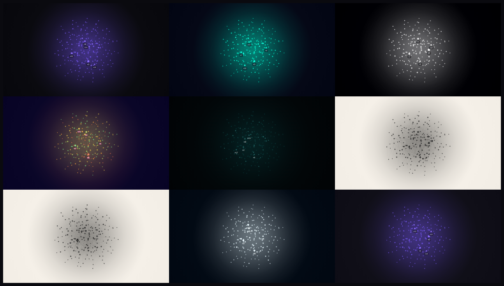

*Left to right, top to bottom: Ambient, Neon, Constellation, Synthwave, Abyss, Ink Wash, Sketch, Celestial, Stained Glass*

**New rendering effects:**
- **Glow breathing** — nodes slowly pulse over ~30s cycles, keeping the wallpaper alive during long desktop sessions
- **Ambient particles** — free-floating motes drift independently of the graph, adding atmospheric depth
- **Chromatic bloom** — bright nodes bloom into hue-shifted halos for a cinematic, photographic feel
- **Depth parallax** — nodes rendered in 2–4 depth layers with independent motion, saturation, and blur
- **Label modes** — per-preset label styling: badge, glow, minimal, and chromatic-split (pink/cyan for Synthwave/Vapor)

**Four new rendering themes** (set `"theme"` in config):
- **Celestial** — stars with diffraction spikes, orbital rings, and a slowly rotating starfield
- **Ink Wash** — watercolor pigment bleed, brush-stroke edges, and paper texture
- **Sketchbook** — hand-drawn jittered lines, notebook paper with ruled lines, graphite smudges
- **Stained Glass** — *(experimental)* Voronoi-tessellated cells, colored by tag, with dark lead borders

All new features are O(n) with zero performance regression. [`docs/themes/`](docs/themes/) has standalone screenshots of each theme.

## Why

The Obsidian graph view is beautiful and almost nobody looks at it, because it's buried two clicks deep inside the app. This project moves it to the one screen you actually stare at all day.

## What It Looks Like

The renderer is tuned for actual desktop use:

- curated presets instead of raw sliders only
- soft cluster halos for tag territories
- smarter labels that surface hubs without clutter
- large-vault-aware scaling so dense graphs stay elegant

**Polished look**


**Classic look**


## Presets

Eighteen curated looks, designed to span genuinely different points across five
visual axes (see [`docs/theme-axes.md`](docs/theme-axes.md)). Pick one in the
settings page — or use it as a starting point and tweak.

| | | |
|:--:|:--:|:--:|
| 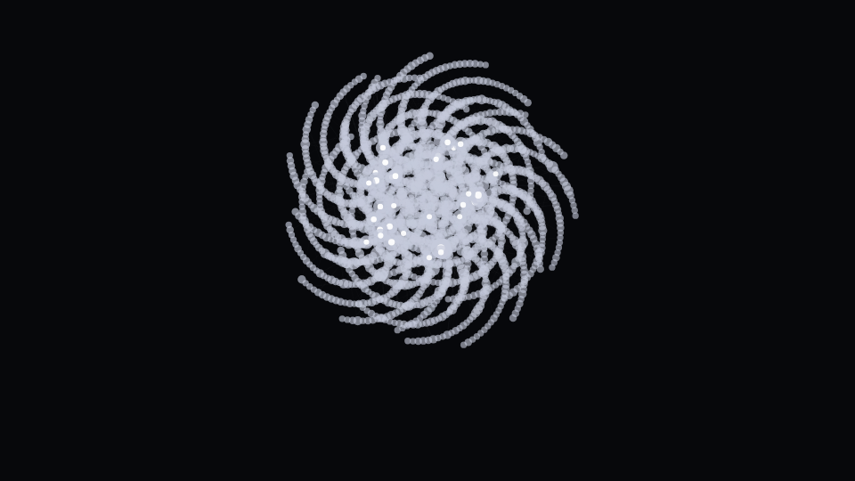<br>**Plain** | 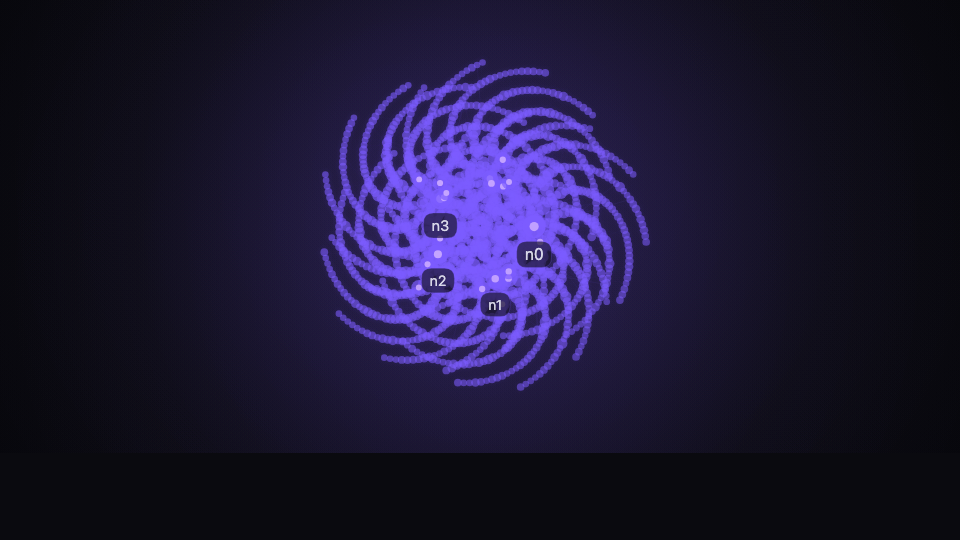<br>**Ambient** | 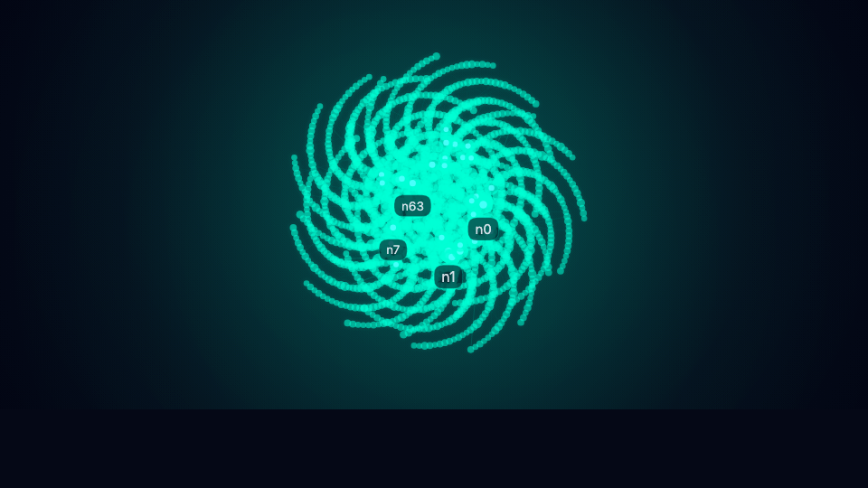<br>**Neon** |
| 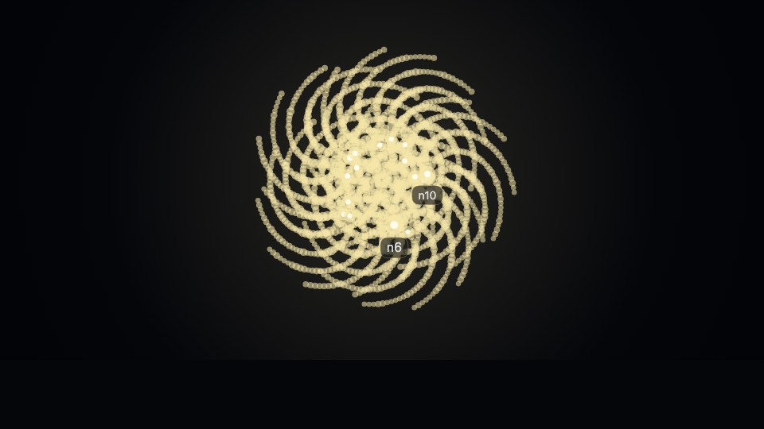<br>**Dense** | 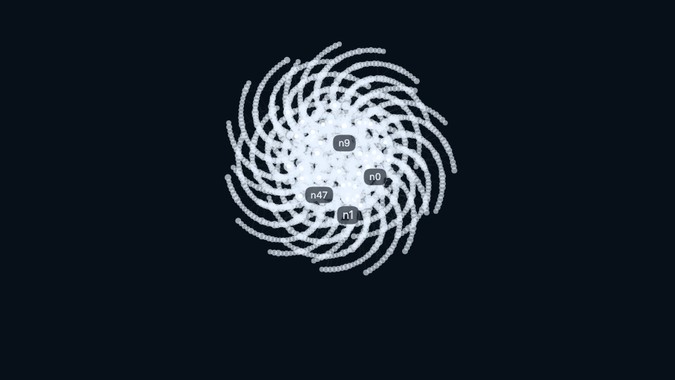<br>**Blueprint** | 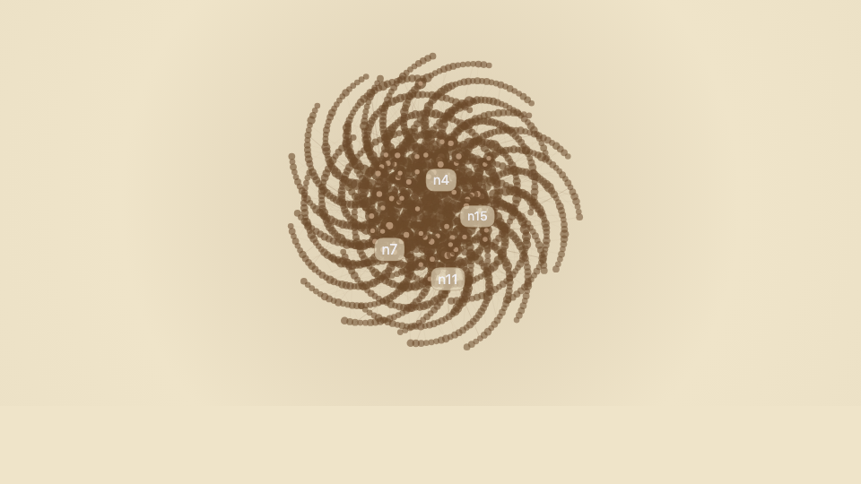<br>**Parchment** |
| 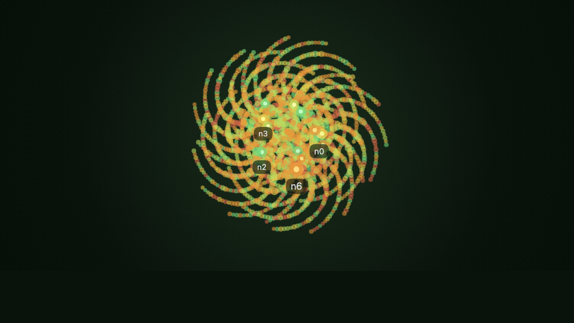<br>**Botanical** | 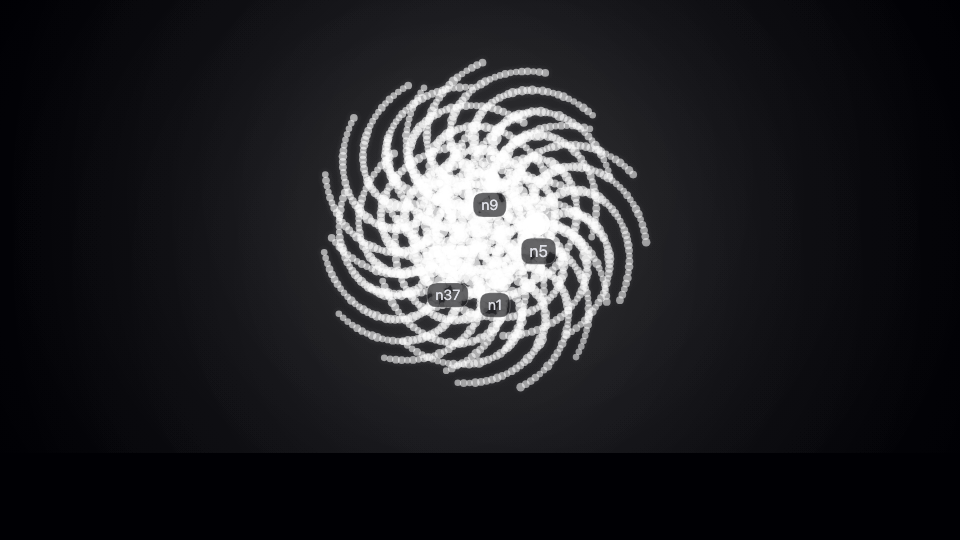<br>**Constellation** | 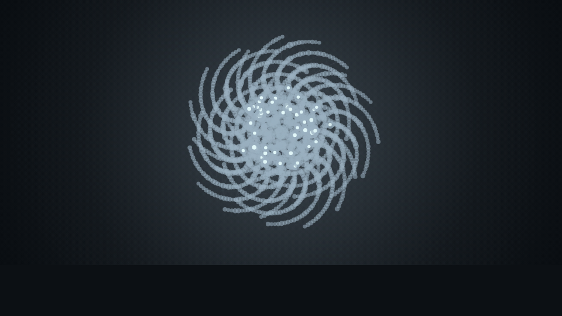<br>**Topographic** |
| 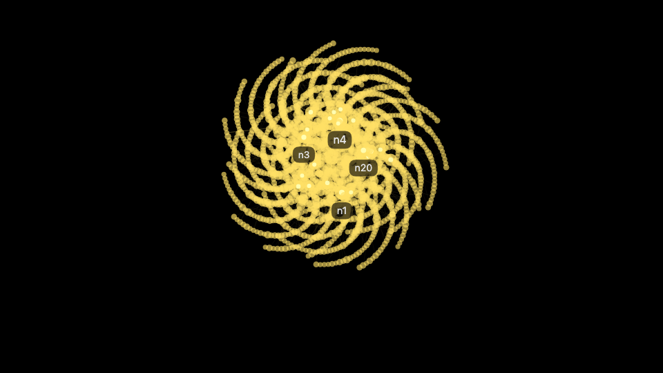<br>**Contrast** | 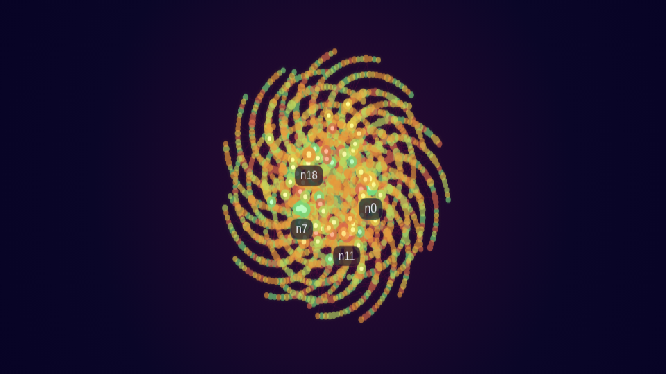<br>**Synthwave** | 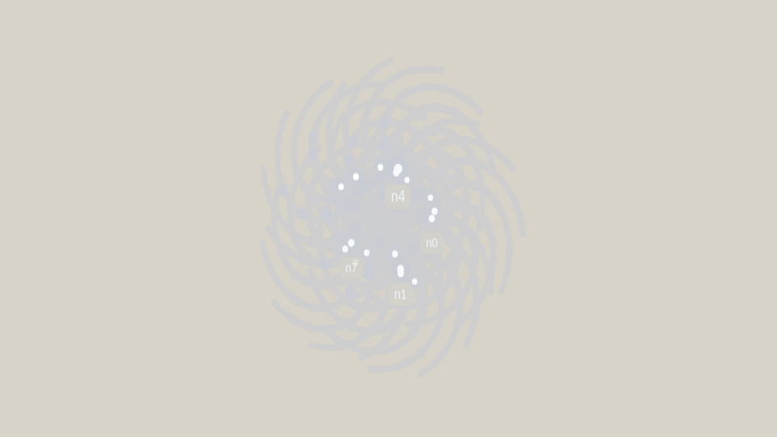<br>**Mist** |
| 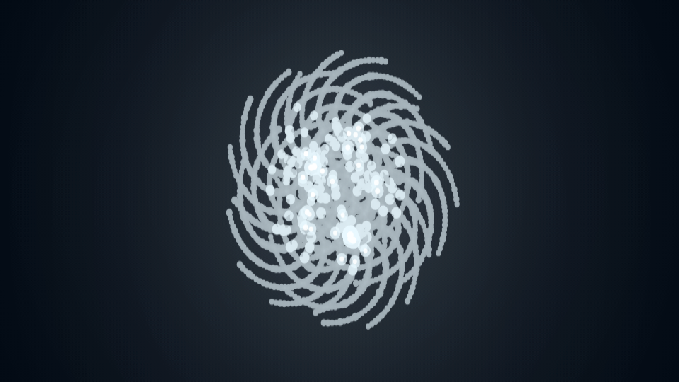<br>**Crystalline** | 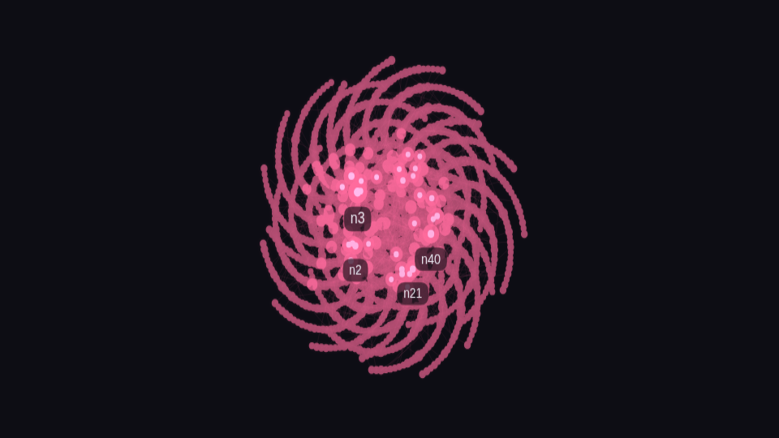<br>**Confetti** | 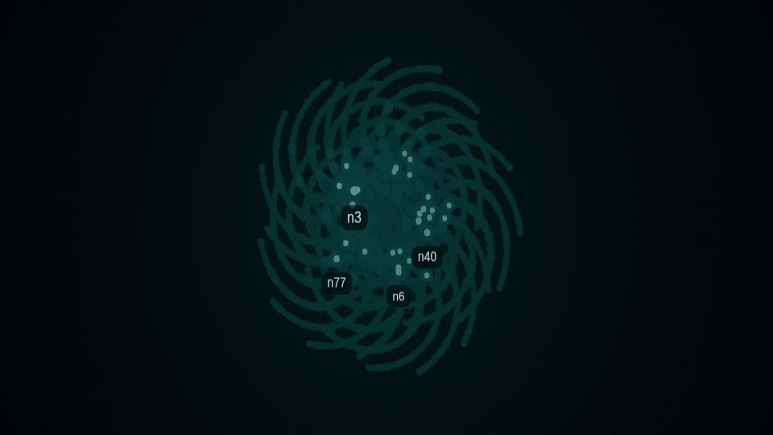<br>**Abyss** |
| 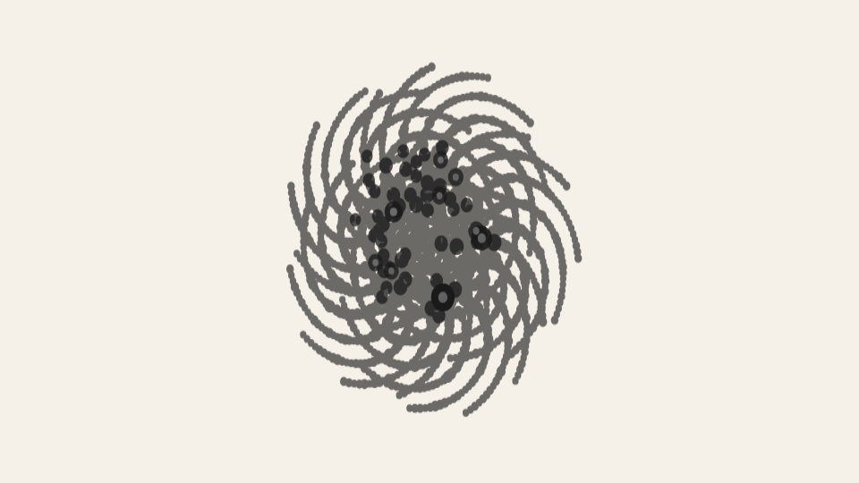<br>**Ink** | 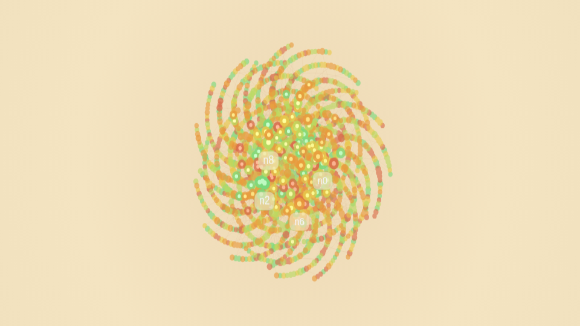<br>**Library** | 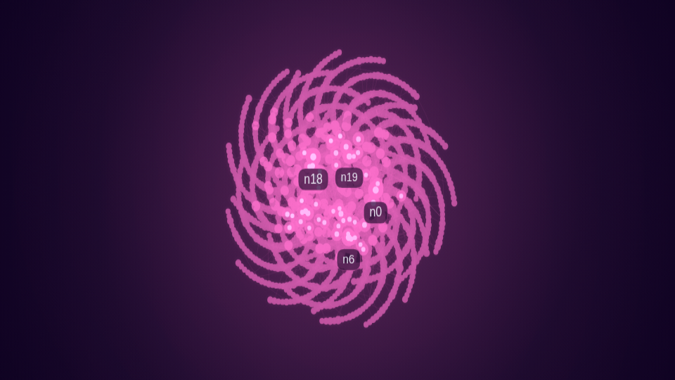<br>**Vapor** |

## Install

You'll need [Node.js](https://nodejs.org) (v20+) and a wallpaper host app:

- **macOS**: [Plash](https://apps.apple.com/us/app/plash/id1494023538) (free, Mac App Store)
- **Windows**: [Lively Wallpaper](https://www.rocksdanister.com/lively/) (free, open source)
- **Linux**: KDE has native support; GNOME via [Hidamari](https://github.com/jeffshee/hidamari); tiling WMs via [xwinwrap](https://github.com/ujjwal96/xwinwrap)

**Quickest start (no clone):**

```bash
npx obsidian-live-wallpaper --vault "/path/to/your/Obsidian/vault"
```

This writes a small config in the current folder and starts the server. Then
point your wallpaper host at the printed `http://127.0.0.1:3000` URL.

**Or clone it** (best if you want to customize or contribute):

```bash
git clone https://github.com/willytop8/obsidian-live-wallpaper.git
cd obsidian-live-wallpaper
npm install
cp config.example.json config.json
```

Edit `config.json` and set `vaultPath` to your Obsidian vault. Then:

```bash
npm start
```

Optional verification before posting or packaging:

```bash
npm test
```

Point your wallpaper host to `http://127.0.0.1:3000` (examples below assume the default port — change if you set a different `port` in `config.json`):

- **Plash**: menu bar → **Add Website** → paste `http://127.0.0.1:3000`
- **Lively**: click **+** → **Open URL** → paste `http://127.0.0.1:3000`

Open `http://127.0.0.1:3000/settings.html` to customize the visual settings. `vaultPath` and `port` stay in `config.json`.

### Use it inside Obsidian

You can also use the graph as a background inside Obsidian itself with the [Live Background](https://github.com/DynamicPlayerSector/obsidian-live-background) community plugin. Point it at `http://127.0.0.1:3000`. For use behind notes, the **Plain**, **Blueprint**, or **Parchment** presets stay out of the way; **Ambient** or **Neon** work better as a standalone wallpaper.

For autostart and troubleshooting, see the platform-specific guides:
- [`macos-setup.md`](macos-setup.md)
- [`windows-setup.md`](windows-setup.md)
- [`linux-setup.md`](linux-setup.md)

## How it works

Three layers, each ignorant of the others:

```
┌──────────┐    graph.json    ┌──────────┐  127.0.0.1:3000  ┌────────────┐
│  parser  │ ───────────────▶ │ renderer │ ───────────────▶ │ Plash /    │
│ (Node)   │                  │  (d3)    │                  │ Lively     │
└──────────┘                  └──────────┘                  └────────────┘
```

1. **`parser.js`** watches your vault, parses `[[wikilinks]]` and tags from every `.md` file, writes `graph.json`, and serves everything on the local loopback interface (`127.0.0.1:3000` by default).
2. **`index.html`** loads `graph.json`, runs a d3 force simulation on a fullscreen canvas, and updates automatically when your vault changes.
3. **Plash / Lively** renders the page as your desktop wallpaper.

The clean separation means only the host changes per platform.

## Configuration

Edit `config.json` for `vaultPath` and `port`. For everything else, use the settings page at `http://127.0.0.1:3000/settings.html` or edit `config.json` directly.

The renderer ships with a local vendored copy of D3, so the wallpaper still works offline after `npm install`.

| Option | Default | Description |
|--------|---------|-------------|
| `vaultPath` | — | Absolute path to your Obsidian vault |
| `port` | `3000` | Local HTTP port for the wallpaper server |
| `accent` | `#7c5cff` | Default node and edge color |
| `background` | `#0a0a0f` | Canvas background color |
| `refreshMs` | `5000` | Fallback refresh interval in ms when live updates are unavailable |
| `linkOpacity` | `0.18` | Base opacity for graph edges |
| `nodeGlow` | `true` | Radial glow halo around each node |
| `glowIntensity` | `1` | Glow halo strength (`0`–`1`); lower for flatter looks |
| `edgeStyle` | `"line"` | Edge rendering: `line`, `curve`, or `none` |
| `nodeColorMode` | `"tag"` | Node coloring: `tag` (by first tag), `age` (by modified time), or `folder` (by top-level vault folder) |
| `labelFont` | `"sans"` | Label typeface: `sans`, `mono`, or `serif` |
| `particles` | `true` | Dots flowing along edges |
| `particleSpeed` | `1` | Multiplier for particle travel speed |
| `particleDensity` | `0.3` | Particle spawn density along links |
| `motionMode` | `"balanced"` | Ambient movement profile: `still`, `light`, `balanced`, or `showcase` |
| `clusterByTag` | `true` | Same-tag nodes gravitate together |
| `clusterHalos` | `true` | Soft color fields behind major tag clusters |
| `edgeColoring` | `true` | Edges inherit source node's tag color |
| `backgroundGradient` | `true` | Subtle radial vignette with accent tint |
| `depthOfField` | `true` | Peripheral nodes dimmer and smaller |
| `noteFlare` | `true` | New notes flash white when they appear |
| `hubLabels` | `false` | Show names on most-connected nodes |
| `hubLabelCount` | `5` | Maximum number of node labels shown when `hubLabels` is on |
| `labelMinImportance` | `0.22` | Minimum node importance required before labels appear |
| `autoScaleLargeVaults` | `true` | Automatically reduces particles, labels, and edge density on dense graphs |
| `maxRenderedNodes` | `5000` | Hard cap on rendered nodes (`100`–`100000`); lowest-importance nodes drop first |
| `showUnresolvedLinks` | `true` | Show ghost nodes for `[[links]]` to notes that don't exist yet |
| `tagColors` | `{}` | Map of Obsidian tag → hex color |
| `ignorePaths` | `[]` | Vault-relative folder names to skip when scanning (e.g. `.obsidian`, `templates`) |
| `fastHash` | `true` | Use the cheaper O(n) change-detection hash; set `false` to force the slower exact one if you ever suspect a missed redraw |
| `autoTheme` | `false` | Swap to `lightAccent`/`lightBackground` and drop glow automatically when the OS is in light mode |
| `lightAccent` | `#39407a` | Accent color used when `autoTheme` is on and the OS is in light mode |
| `lightBackground` | `#ece6d6` | Background color used when `autoTheme` is on and the OS is in light mode |
| `glowBreathing` | `true` | Nodes slowly pulse over ~30s cycles |
| `glowBreathingSpeed` | `1` | Breathing cycle speed multiplier (`0.1`–`3`) |
| `glowBreathingDepth` | `0.15` | Maximum glow radius swell (`0`–`0.4`) |
| `ambientParticles` | `true` | Free-floating atmospheric particles independent of the graph |
| `ambientParticleCount` | `80` | Number of ambient particles (`0`–`300`) |
| `ambientParticleSpeed` | `0.3` | Ambient particle drift speed (`0.05`–`2`) |
| `ambientParticleSize` | `1.5` | Ambient particle base radius in px (`0.5`–`4`) |
| `chromaticBloom` | `true` | Bright nodes bloom into hue-shifted outer halos |
| `chromaticBloomIntensity` | `0.4` | Bloom strength (`0`–`1`) |
| `depthParallax` | `true` | Render nodes in depth layers with independent motion |
| `depthParallaxStrength` | `0.5` | Layer separation intensity (`0`–`1`) |
| `depthParallaxLayers` | `3` | Number of depth layers (`2`–`4`) |
| `theme` | `\"default\"` | Rendering engine: `default`, `celestial`, `sketch`, `wash`, or `stained-glass` |
| `labelStyle` | *(see presets)* | Per-preset label styling object with `mode`, `glowColor`, `chromaticSplit`, `fontStyle` |

### Tags vs links

Tags and links do different things in the wallpaper. **Links** (`[[wikilinks]]`) create **edges** between nodes — they define the graph structure. **Tags** (`#tag` in frontmatter or body) control **node color** and **clustering** — they're purely visual grouping. A note can have both, and they work independently.

### Unresolved links

With `showUnresolvedLinks` on (the default), any `[[wikilink]]` that points to a note that doesn't exist yet still appears in the graph as a dimmer, smaller "ghost" node. This lets you see the shape of your planned connections, not just what you've written so far. Turn it off if you only want real notes.

### Duplicate note names

If two markdown files share the same basename (e.g. `Index.md` in different folders), the parser automatically prefixes their node IDs with the folder path so both appear in the graph. A `[[Index]]` wikilink will connect to all notes named `Index`. Labels still show the short name.

### Coloring modes

Three ways to color nodes, set with `nodeColorMode`:

- **`tag`** (default) — each note picks up the color of its first tag. Set tag colors in `tagColors`, or leave it empty and everything uses the accent. Same-tag nodes pull toward each other when `clusterByTag` is on.
- **`age`** — fresh notes are green, stale ones fade to red. Good for seeing which parts of your vault you actually touch. Botanical uses this.
- **`folder`** — nodes are colored by their top-level vault folder instead of tags. Notes at the vault root fall back to the accent color.

### Edge styles

`edgeStyle` changes how links are drawn. `line` is straight. `curve` gives soft bezier arcs. `none` hides edges entirely and lets clustering do the talking.

### Presets

Eighteen one-click looks, each a meaningfully different scene rather than a palette swap:

- **Plain** — minimal, still, mono accent
- **Ambient** — the default polychrome drift with hubs
- **Neon** — high-contrast cyber palette, heavy glow
- **Dense** — tight clusters for busy vaults
- **Blueprint** — technical drawing feel, muted on dark navy
- **Parchment** — warm paper tones, subtle motion
- **Botanical** — age-colored nodes, organic spread
- **Constellation** — edges hidden, nodes float in clusters
- **Topographic** — curved edges, map-like flow
- **Contrast** — bold single-accent, stripped-down
- **Synthwave** — retro cyberpunk pink/cyan glow on deep indigo, age-colored
- **Mist** — silver-white on warm grey, ultra-faint edges, soft drift
- **Crystalline** — ice-white halos on midnight, no edges, sharp glow
- **Confetti** — party mode, randomized bright palette, dense particles
- **Abyss** — deep-sea bioluminescence, teal on near-black, slow drift
- **Ink** — sumi-e aesthetic, black nodes on off-white, no edges
- **Library** — warm sepia parchment, age-colored, still composition
- **Vapor** — vaporwave pastels on dark purple, curved flow, heavy glow

Swap between them from the settings page. For the design thinking behind the lineup, see [`docs/theme-axes.md`](docs/theme-axes.md).

### Large vaults

Big graphs turn into mush if you render everything. With `autoScaleLargeVaults` on (the default), the renderer quietly backs off as your vault grows:

| Vault size | What happens |
|------------|--------------|
| Up to ~350 nodes | Full fidelity — everything on |
| 350–900 nodes | Fewer particles, softer edges |
| 900–3,000 nodes | Fewer labels, lower glow, sparser particles |
| 3,000–10,000 nodes | Glow and halos off, labels tighten, depth effects back off, render scale drops to stay smooth |
| 10,000+ nodes | Particles off, halos off, labels limited to the biggest hubs, render scale drops further, hard cap of about 2,800 rendered nodes |

If you want a tighter ceiling, set `maxRenderedNodes` — least-connected notes drop first.

### Incremental parsing

The first launch reads your whole vault. After that, normal edits only rebuild the parts of the graph that actually changed, so quick note updates do not trigger a full vault re-scan. Rapid saves are grouped together, and the wallpaper refreshes automatically as those changes land.

## License

MIT. Built by [William Ricchiuti](https://william-ricchiuti.com).
