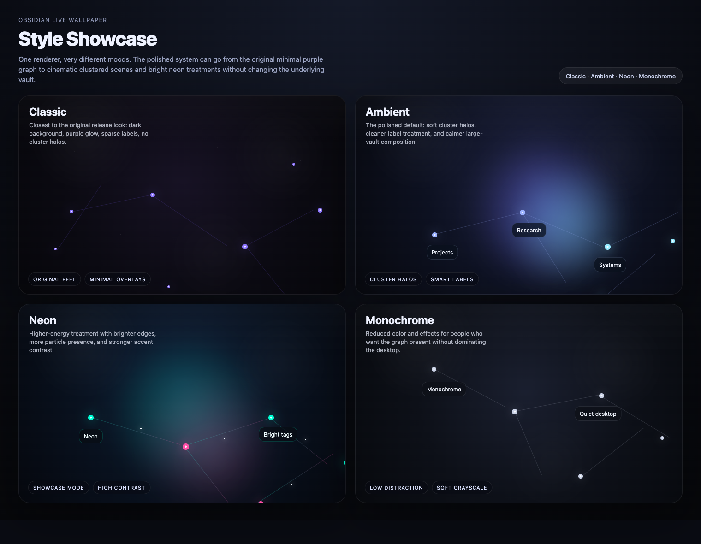
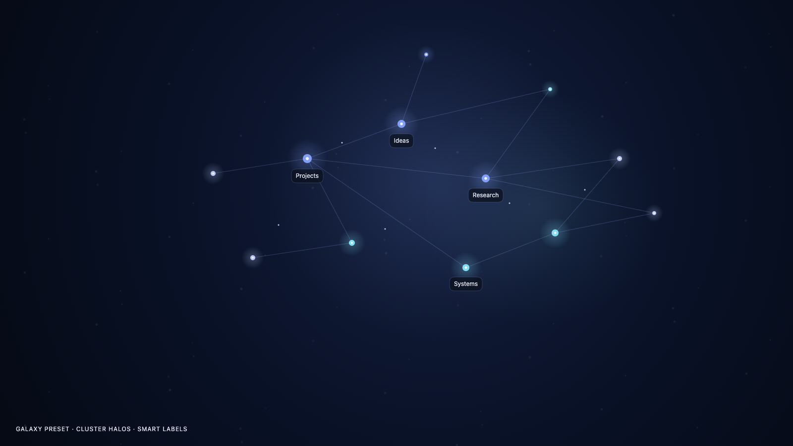
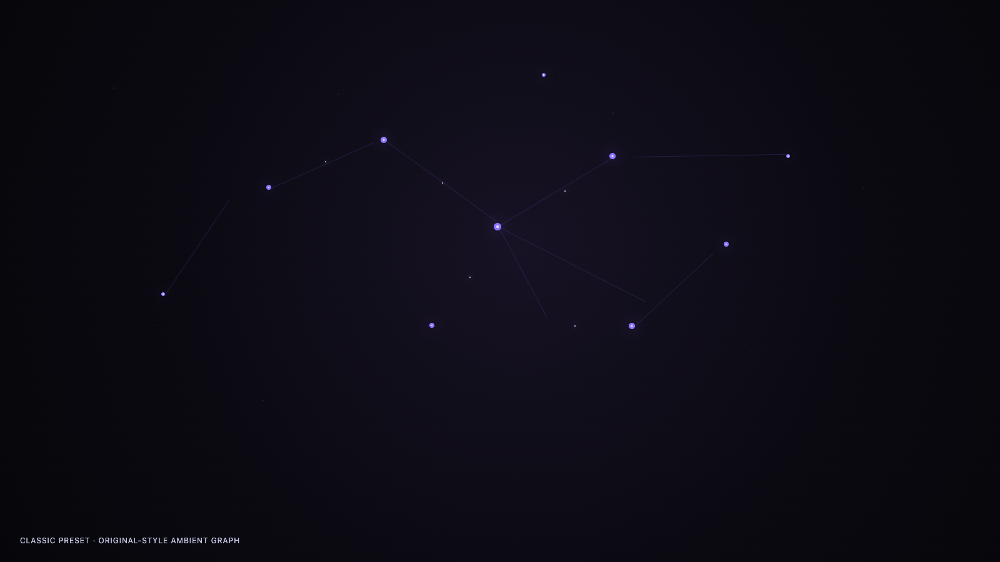
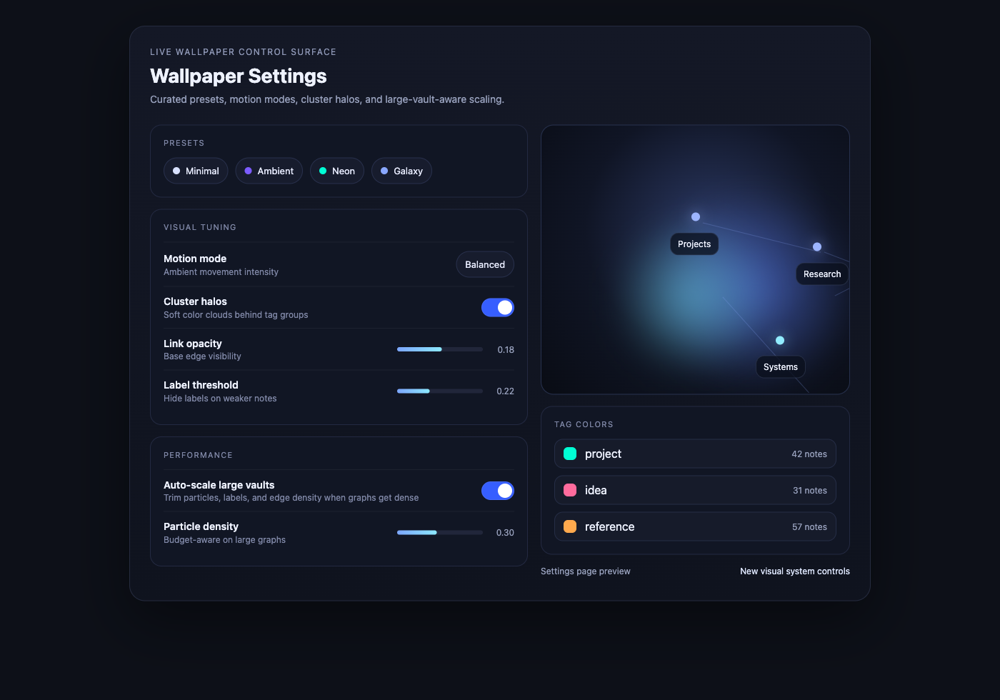

# Obsidian Live Wallpaper

> Turn your Obsidian vault into an ambient desktop scene instead of another hidden sidebar.




Obsidian Live Wallpaper turns your vault graph into a live desktop backdrop: glowing nodes, tag-colored clusters, curated visual presets, smarter hub labels, and motion that stays atmospheric instead of noisy. It is built to feel like wallpaper first, graph tooling second.

**macOS, Windows, and Linux.**

## Why

The Obsidian graph view is beautiful and almost nobody looks at it, because it's buried two clicks deep inside the app. This project moves it to the one screen you actually stare at all day.

## What It Looks Like

The renderer is tuned for actual desktop use:

- curated presets instead of raw sliders only
- soft cluster halos for tag territories
- smarter labels that surface hubs without clutter
- large-vault-aware scaling so dense graphs stay elegant

**Polished look**



**Classic look**





## Install

You'll need [Node.js](https://nodejs.org) (v18+) and a wallpaper host app:

- **macOS**: [Plash](https://apps.apple.com/us/app/plash/id1494023538) (free, Mac App Store)
- **Windows**: [Lively Wallpaper](https://www.rocksdanister.com/lively/) (free, open source)
- **Linux**: KDE has native support; GNOME via [Hidamari](https://github.com/jeffshee/hidamari); tiling WMs via [xwinwrap](https://github.com/ujjwal96/xwinwrap)

```bash
git clone https://github.com/willytop8/obsidian-live-wallpaper.git
cd obsidian-live-wallpaper
npm install
cp config.example.json config.json
```

Edit `config.json` and set `vaultPath` to your Obsidian vault. Then:

```bash
npm start
```

Optional verification before posting or packaging:

```bash
npm test
```

Point your wallpaper host to `http://127.0.0.1:3000` (examples below assume the default port — change if you set a different `port` in `config.json`):

- **Plash**: menu bar → **Add Website** → paste `http://127.0.0.1:3000`
- **Lively**: click **+** → **Open URL** → paste `http://127.0.0.1:3000`

Open `http://127.0.0.1:3000/settings.html` to customize the visual settings. `vaultPath` and `port` stay in `config.json`.

### Use it inside Obsidian

You can also use the graph as a background inside Obsidian itself with the [Live Background](https://github.com/DynamicPlayerSector/obsidian-live-background) community plugin. Point it at `http://127.0.0.1:3000`. For use behind notes, the **Plain**, **Blueprint**, or **Parchment** presets stay out of the way; **Ambient** or **Neon** work better as a standalone wallpaper.

For autostart and troubleshooting, see the platform-specific guides:
- [`macos-setup.md`](macos-setup.md)
- [`windows-setup.md`](windows-setup.md)
- [`linux-setup.md`](linux-setup.md)

## How it works

Three layers, each ignorant of the others:

```
┌──────────┐    graph.json    ┌──────────┐  127.0.0.1:3000  ┌────────────┐
│  parser  │ ───────────────▶ │ renderer │ ───────────────▶ │ Plash /    │
│ (Node)   │                  │  (d3)    │                  │ Lively     │
└──────────┘                  └──────────┘                  └────────────┘
```

1. **`parser.js`** watches your vault, parses `[[wikilinks]]` and tags from every `.md` file, writes `graph.json`, and serves everything on the local loopback interface (`127.0.0.1:3000` by default).
2. **`index.html`** loads `graph.json`, runs a d3 force simulation on a fullscreen canvas, polls for updates.
3. **Plash / Lively** renders the page as your desktop wallpaper.

The clean separation means only the host changes per platform.

## Configuration

Edit `config.json` for `vaultPath` and `port`. For everything else, use the settings page at `http://127.0.0.1:3000/settings.html` or edit `config.json` directly.

The renderer ships with a local vendored copy of D3, so the wallpaper still works offline after `npm install`.

| Option | Default | Description |
|--------|---------|-------------|
| `vaultPath` | — | Absolute path to your Obsidian vault |
| `port` | `3000` | Local HTTP port for the wallpaper server |
| `accent` | `#7c5cff` | Default node and edge color |
| `background` | `#0a0a0f` | Canvas background color |
| `refreshMs` | `5000` | Polling interval in ms (increase for 2000+ notes) |
| `linkOpacity` | `0.18` | Base opacity for graph edges |
| `nodeGlow` | `true` | Radial glow halo around each node |
| `glowIntensity` | `1` | Glow halo strength (`0`–`1`); lower for flatter looks |
| `edgeStyle` | `"line"` | Edge rendering: `line`, `curve`, or `none` |
| `nodeColorMode` | `"tag"` | Node coloring: `tag` (by first tag) or `age` (by modified time) |
| `particles` | `true` | Dots flowing along edges |
| `particleSpeed` | `1` | Multiplier for particle travel speed |
| `particleDensity` | `0.3` | Particle spawn density along links |
| `motionMode` | `"balanced"` | Ambient movement profile: `light`, `balanced`, or `showcase` |
| `clusterByTag` | `true` | Same-tag nodes gravitate together |
| `clusterHalos` | `true` | Soft color fields behind major tag clusters |
| `edgeColoring` | `true` | Edges inherit source node's tag color |
| `backgroundGradient` | `true` | Subtle radial vignette with accent tint |
| `depthOfField` | `true` | Peripheral nodes dimmer and smaller |
| `noteFlare` | `true` | New notes flash white when they appear |
| `hubLabels` | `false` | Show names on most-connected nodes |
| `hubLabelCount` | `5` | Maximum number of node labels shown when `hubLabels` is on |
| `labelMinImportance` | `0.22` | Minimum node importance required before labels appear |
| `autoScaleLargeVaults` | `true` | Automatically reduces particles, labels, and edge density on dense graphs |
| `maxRenderedNodes` | `5000` | Hard cap on rendered nodes (`100`–`100000`); lowest-importance nodes drop first |
| `showUnresolvedLinks` | `true` | Show ghost nodes for `[[links]]` to notes that don't exist yet |
| `tagColors` | `{}` | Map of Obsidian tag → hex color |

### Tags vs links

Tags and links do different things in the wallpaper. **Links** (`[[wikilinks]]`) create **edges** between nodes — they define the graph structure. **Tags** (`#tag` in frontmatter or body) control **node color** and **clustering** — they're purely visual grouping. A note can have both, and they work independently.

### Unresolved links

With `showUnresolvedLinks` on (the default), any `[[wikilink]]` that points to a note that doesn't exist yet still appears in the graph as a dimmer, smaller "ghost" node. This lets you see the shape of your planned connections, not just what you've written so far. Turn it off if you only want real notes.

### Duplicate note names

If two markdown files share the same basename (e.g. `Index.md` in different folders), the parser automatically prefixes their node IDs with the folder path so both appear in the graph. A `[[Index]]` wikilink will connect to all notes named `Index`. Labels still show the short name.

### Coloring modes

`nodeColorMode` picks how each node gets its color:

- **`tag`** (default) — reads the first tag from each note's frontmatter (`tags: [project, ...]`) or the first inline `#tag` in the body. If that tag has a color in `tagColors`, the node renders in that color instead of the accent. Same-tag nodes cluster together when `clusterByTag` is on.
- **`age`** — colors nodes by last-modified time along a green→red spectrum (fresh → stale). Useful for seeing which parts of the vault are active. The **Botanical** preset uses this mode.

### Edge styles

`edgeStyle` controls how links are drawn: `line` for straight edges, `curve` for bezier arcs (used by **Topographic**), or `none` to hide edges entirely and rely on clustering alone (used by **Constellation**).

### Presets

The settings page includes ten curated one-click looks tuned for wallpaper use: **Plain**, **Ambient**, **Neon**, **Dense**, **Blueprint**, **Parchment**, **Botanical**, **Constellation**, **Topographic**, and **Contrast**. Each sweeps multiple settings at once — palette, motion, edge style, coloring mode, and label density — so they're meaningfully different rather than recolors of the same scene. The design framework behind them is documented in [`docs/theme-axes.md`](docs/theme-axes.md).

### Large vault scaling

With `autoScaleLargeVaults` on, the renderer trims particles, labels, glow, and edge density as the graph gets denser. Tiers are based on node and link counts:

| Tier | Trigger | Behavior |
|------|---------|----------|
| default | ≤350 nodes / ≤1200 links | Full fidelity |
| dense | >350 nodes or >1200 links | Reduced particle density, slightly dimmed edges |
| huge | >900 nodes or >3200 links | Fewer labels, lower glow, sparser particles |
| massive | >3000 nodes or >10000 links | Glow off, halos off, thinned edges, minimal labels |
| ultra | >10000 nodes or >40000 links | Particles off, edges sampled, hard cap at 4000 rendered nodes |

`maxRenderedNodes` provides a hard cap on top of this — the lowest-importance nodes are dropped first. The goal is to keep the wallpaper atmospheric instead of turning into an unreadable tangle.

### Performance: incremental parsing

The parser uses an MD5-based file cache and only re-parses notes whose content actually changed between scans. Rapid saves are debounced into a single parse, so working in Obsidian doesn't thrash the wallpaper renderer. Cold start still reads every `.md` file once; subsequent passes are near-instant on large vaults.

## License

MIT. Built by [William Ricchiuti](https://william-ricchiuti.com).
